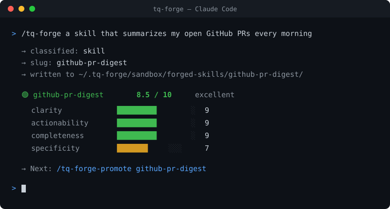

<div align="center">

# 🔨 tq-forge

**An autonomous skill + agent factory for [Claude Code](https://claude.com/claude-code).**

Forge new slash-command skills and multi-file agents from a one-line intent —
scored, sandboxed, and promoted into production without leaving your terminal.

[](https://www.npmjs.com/package/tq-forge)
[](https://github.com/tanishq286/tq-forge/actions/workflows/ci.yml)
[](LICENSE)
[](https://claude.com/claude-code)


<br/>



</div>

---

## What is this?

Claude Code lets you define **skills** (`/your-command`) and **agents** (personas
with their own system prompt). Writing good ones by hand is fiddly: you have to
remember the file shape, the frontmatter, the section structure, and you have no
feedback on whether what you wrote is any good.

**tq-forge turns that into a one-liner.** You describe what you want; it decides
whether you need a skill or an agent, writes it to a sandbox, **scores it on
structural quality (0–10)**, and only lets you promote it once it passes. It's a
small, opinionated factory for your own Claude Code toolkit.

```
You:  /tq-forge a skill that summarizes my open GitHub PRs every morning

      → classified: skill
      → slug: github-pr-digest
      → written to ~/.tq-forge/sandbox/forged-skills/github-pr-digest/
      🟢 skill github-pr-digest: 8.5/10 (excellent)
         clarity            9  █████████░
         actionability      9  █████████░
         completeness       9  █████████░
         specificity        7  ███████░░░
      → Next: /tq-forge-promote github-pr-digest
```

## Why you'd want it

- **No more blank-page skill writing.** Describe the workflow; get a structured,
  conventions-following SKILL.md.
- **Quality gate built in.** A heuristic scorer checks clarity, actionability,
  completeness, and specificity. Agents add consistency + handoff clarity.
  Nothing reaches production below 7/10.
- **Sandbox → promote workflow.** Everything starts in `~/.tq-forge/sandbox/`.
  You review and score before a single file touches your live skills dir.
- **Eight agent archetypes.** researcher, coder, business-analyst, ops-manager,
  scraper, reviewer, sales-agent, custom — each with a rigid output format and a
  `{{CONTEXT}}` slot for your own domain.
- **Self-curating.** `/tq-forge-improve` rewrites only the weak sections;
  `/tq-forge-scan` finds workflows you keep doing by hand that should be skills.

## Install

Two ways — pick whichever fits your setup.

### Option A — npm (one command)

```bash
npx tq-forge install
```

This copies the 13 skills into `~/.claude/skills/`, drops the support scripts in
`~/.tq-forge/install/`, seeds your state home, and checks for `bash`/`python3`.
Then restart Claude Code. Verify any time with `npx tq-forge doctor`.

```bash
npx tq-forge doctor      # check the install + deps
npx tq-forge uninstall   # remove skills (keeps your forged data)
```

### Option B — Claude Code plugin marketplace

```
/plugin marketplace add tanishq286/tq-forge
/plugin install tq-forge@tq-forge
```

Then restart Claude Code (or reload skills) and verify with `/tq-forge-status`.

> **Requirements:** Claude Code, `bash`, and `python3` (standard library only —
> no pip installs). Skills work identically whether installed via npm or as a
> plugin — they resolve their scripts from `$CLAUDE_PLUGIN_ROOT` when loaded as a
> plugin, and from `~/.tq-forge/install` otherwise.

### First-run setup (30 seconds)

Forged **agents** inject your domain context. Seed it once:

```bash
mkdir -p ~/.tq-forge
$EDITOR ~/.tq-forge/context.md   # who you are, what you build, your hard rules
```

(If you skip this, agents are still generated — just generic. Skills don't need it.)

## The 13 commands

| Command | What it does |
|---|---|
| `/tq-forge <intent>` | Classify intent → scaffold a skill **or** agent → score → log |
| `/tq-forge-skill <intent>` | Force **skill** mode |
| `/tq-forge-agent <intent>` | Force **agent** mode (5-file scaffold) |
| `/tq-forge-promote <slug>` | Re-score, then copy sandbox → production |
| `/tq-forge-improve <slug>` | Rewrite only the weak-scoring sections |
| `/tq-forge-improve-all` | Batch-improve everything below 7/10 |
| `/tq-forge-test <slug>` | Re-score without rewriting |
| `/tq-forge-list` | Inventory of skills + agents with scores |
| `/tq-forge-agents` | Agent registry: kind, score, hand-off wiring |
| `/tq-forge-status` | Forge state, queue depth, halt status |
| `/tq-forge-scan` | Detect coverage gaps in your skill library |
| `/tq-forge-queue` | View / manage deferred work |
| `/tq-forge-resume` | Clear the pause flag and drain the queue |

## How it works

```
  /tq-forge "intent"
        │
        ▼
   ┌─────────┐   classify    ┌──────────────┐
   │ intent  │ ────────────▶ │ skill | agent │
   └─────────┘               └──────┬────────┘
                                    │ scaffold
                                    ▼
                    ~/.tq-forge/sandbox/forged-{skills,agents}/<slug>/
                                    │ quality-score.sh + dry-test.sh
                                    ▼
                            ┌───────────────┐
                            │ score ≥ 7 ?   │
                            └──┬────────┬───┘
                          yes │        │ no
                              ▼        ▼
                  /tq-forge-promote   /tq-forge-improve (1 targeted pass)
                              │
                              ▼
                   ~/.claude/skills/<slug>/   ← live
```

**Sandbox is mandatory.** The only path that writes into your live skills dir is
`/tq-forge-promote`, and it re-scores first — so a stale score can never sneak a
weak artifact into production.

### The scorer

`scripts/quality-score.sh` is a static, **token-free** heuristic (pure Python
stdlib). It never makes an LLM call, so scoring is free and deterministic.

| Dimension | Skills | Agents | Checks |
|---|:---:|:---:|---|
| clarity | ✓ | ✓ | "When to use" is concrete and ≤ ~3 sentences |
| actionability | ✓ | ✓ | Numbered steps with copy-pasteable commands |
| completeness | ✓ | ✓ | Pitfalls + Verification + Tags present |
| specificity | ✓ | ✓ | Real paths/tools, not "do the thing" |
| consistency | | ✓ | Output format is a defined, rigid schema |
| handoff_clarity | | ✓ | `hand_off_to` names targets + conditions |

`scripts/dry-test.sh` adds structural validation (frontmatter, the 5 agent files,
valid `tools.json`, word-count bounds).

## Configuration

| Env var | Default | Purpose |
|---|---|---|
| `TQ_FORGE_HOME` | `~/.tq-forge` | State home: sandbox, logs, queue, your `context.md` |
| `CLAUDE_SKILLS_DIR` | `~/.claude/skills` | Where `/tq-forge-promote` installs |

State layout:

```
~/.tq-forge/
├── context.md                    # your domain context (injected into agents)
├── skill-log.json                # inventory of everything forged
├── forge-queue.json              # deferred intents + needs_manual_review
├── halt.flag                     # touch to pause; remove to resume
└── sandbox/
    ├── forged-skills/<slug>/SKILL.md
    └── forged-agents/<slug>/{AGENT.md, system-prompt.md, tools.json, ...}
```

## Pause / resume

`touch ~/.tq-forge/halt.flag` pauses all forge work — new intents queue instead
of running. `/tq-forge-resume` clears the flag and drains the queue. Handy when
you want to batch up requests and run them deliberately.

## FAQ

**Does scoring cost tokens?** No. The scorer is static Python — zero API calls.

**Will it overwrite my existing skills?** No. Promote refuses on slug collisions
and never writes outside `CLAUDE_SKILLS_DIR`. The sandbox copy stays as a rollback.

**Can I edit a forged skill by hand?** Yes — then `/tq-forge-test <slug>` to
re-score it.

**Is the scorer the final word on quality?** It's a structural floor, not a
ceiling. It catches missing sections and vagueness; it can't judge whether your
procedure is *correct*. Always read what you promote.

## Contributing

Issues and PRs welcome — new agent archetypes, smarter scoring heuristics, and
example skills especially. See [CONTRIBUTING.md](CONTRIBUTING.md).

## License

[MIT](LICENSE) © tanishq286
